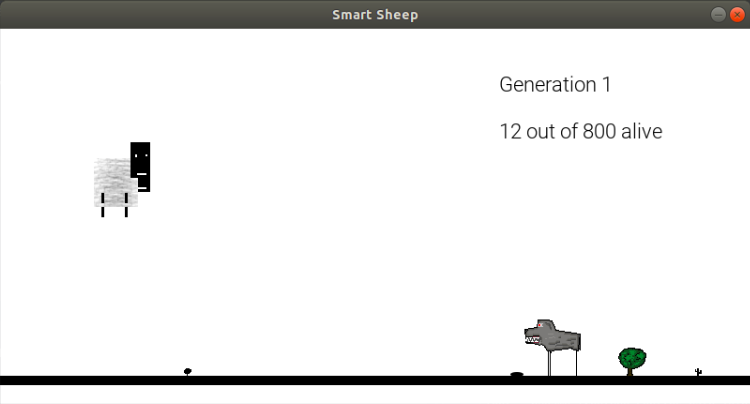

# Smart Sheep 

Smart Sheep is a simple genetic algorithm implementation with graphic user interface. The project, using machine learning and neural networks, teaches sheep to survive. 



## Basic Overview 

Smart Sheep is a highschool project for exam in informatics. [Original version](https://github.com/urhprimozic/inf_skg), written in Slovene, was translated into English.  
Smart Sheep offers a GUI, written in pygame, in which sheep are being controlled using artificial intelligence. Using genetic algorithm, you can train sheep's neural nets into surviving. 

## Installation 

Python modules [numpy](https://www.numpy.org/) and [pygame](https://www.pygame.org/news) are needed. 

``` 
python -m pip install --user numpy 
python3 -m pip install -U pygame --user 
``` 
Project is not yet on pip, therefore options are downloading or cloning. 

## User interface
Run [smart_sheep](smart_sheep.py) and use buttons on the screen.

## Layout 

[net][net.py] includes classes for neural networks. In [settings](settings.py) are global variables. [gui](gui.py) is just a helping script, that makes programming with pygame easier. [smart_sheep](smart_sheep.py) includes genetic algorithm implementation and GUI implementation. 

### Genetic algorithm 

``` 

ga(generation_size, max_generation) 

``` 
Genetic algorithm is a function for machine learning, that makes improved generation of neural nets using the parent generation. Every neural net from parental generation is tested in an environment and is assigned a value using a fitness function. New generation of NN than has more good qualities and less bad ones. 
Testing is done using GUI. 

### GUI 

``` 
def test(generation, generation_size, nets): 
``` 
The whole generation is tested at the same time. Every sheep is controlled by its own NN. Inputs are the distances to the wolf and to the food, outputs define, whenever a sheep should jump. 
Sheep is walking thru the field. It must collect food to survive, and avoid (= jump over) wolfs. 

## Contributing   

Feel free to use the code or contribute. For collaboration, @ me. 

## Thanks 

Special thanks to Micheal A. Nielsen, "Neural Networks and Deep Learning, 
Determination Press,2015 
